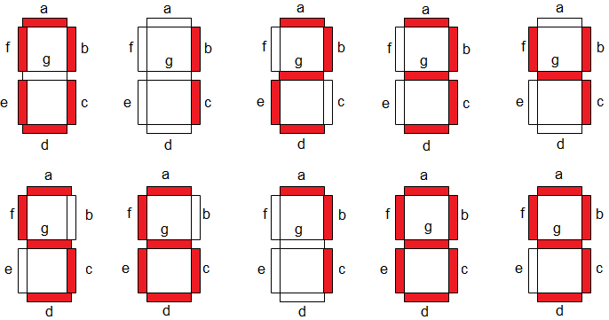

# Seven Segment Display Driver (0–9) – VHDL Project

## Project Overview
This project implements a **7-segment display driver** in VHDL that takes a 4-bit binary input (0–9) and generates the corresponding active-high segment outputs (`a–g`).  
The design is purely **combinational** and verified using ModelSim.

This project is synthesizable and suitable for Synopsys tools, and simulation is done using ModelSim.

## Inputs and Outputs
| Signal | Direction | Description |
|--------|-----------|-------------|
| `A[3:0]` | Input | 4-bit binary input |
| `Y[6:0]` | Output | 7-segment output (a–g, active high) |

## Segment Mapping (active high)

Decimal | Input (A) | Output (Y)   | Segments (a–g)
--------|------------|--------------|----------------------------
0       | 0000       | 1111110      | a(1) b(1) c(1) d(1) e(1) f(1) g(0)
1       | 0001       | 0110000      | a(0) b(1) c(1) d(0) e(0) f(0) g(0)
2       | 0010       | 1101101      | a(1) b(1) c(0) d(1) e(1) f(0) g(1)
3       | 0011       | 1111001      | a(1) b(1) c(1) d(1) e(0) f(0) g(1)
4       | 0100       | 0110011      | a(0) b(1) c(1) d(0) e(0) f(1) g(1)
5       | 0101       | 1011011      | a(1) b(0) c(1) d(1) e(0) f(1) g(1)
6       | 0110       | 1011111      | a(1) b(0) c(1) d(1) e(1) f(1) g(1)
7       | 0111       | 1110000      | a(1) b(1) c(1) d(0) e(0) f(0) g(0)
8       | 1000       | 1111111      | a(1) b(1) c(1) d(1) e(1) f(1) g(1)
9       | 1001       | 1111011      | a(1) b(1) c(1) d(1) e(0) f(1) g(1)
Other   | 1010–1111  | 0000000      | a(0) b(0) c(0) d(0) e(0) f(0) g(0)

## Files

- `.vscode/` – VS Code project settings  
- `work/` – ModelSim working library (auto-generated)  
- `sevenSeg.mpf` – ModelSim project file  
- `sevenSeg.vhd` – main 7-segment driver  
- `sevenSeg_tb.vhd` – testbench  
- `vsim.wlf` – ModelSim waveform file (simulation output)  

## Tools
- **Editor**: VS Code  
- **Simulation**: ModelSim

## Simulation
The testbench cycles through inputs `0–15` with 1 ns delay each.  
Expected behavior:
- Inputs `0–9`: correct digit shown  
- Inputs `10–15`: blank output

   | Decimal | Input (A) | Output (Y) | Segments (a–g) | Expected |
   |---------|-----------|------------|----------------|----------|
   | 0 | 0000 | 1111110 | a b c d e f | ✅ |
   | 1 | 0001 | 0110000 | b c | ✅ |
   | 2 | 0010 | 1101101 | a b d e g | ✅ |
   | 3 | 0011 | 1111001 | a b c d g | ✅ |
   | 4 | 0100 | 0110011 | b c f g | ✅ |
   | 5 | 0101 | 1011011 | a c d f g | ✅ |
   | 6 | 0110 | 1011111 | a c d e f g | ✅ |
   | 7 | 0111 | 1110000 | a b c | ✅ |
   | 8 | 1000 | 1111111 | a b c d e f g | ✅ |
   | 9 | 1001 | 1111011 | a b c d f g | ✅ |
   | Other | 1010–1111 | 0000000 | none | ✅ |
